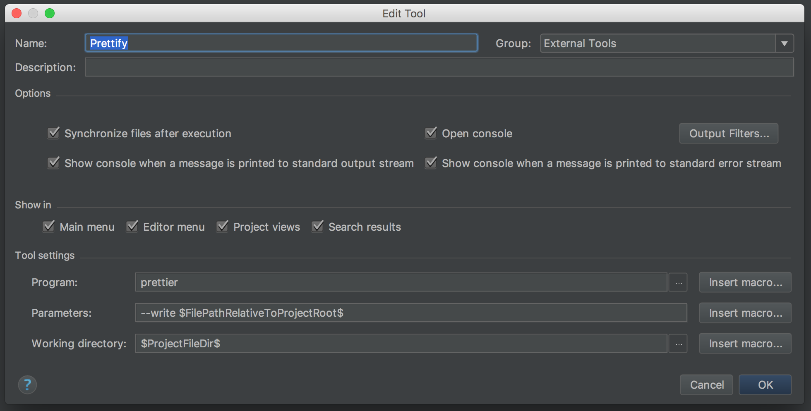
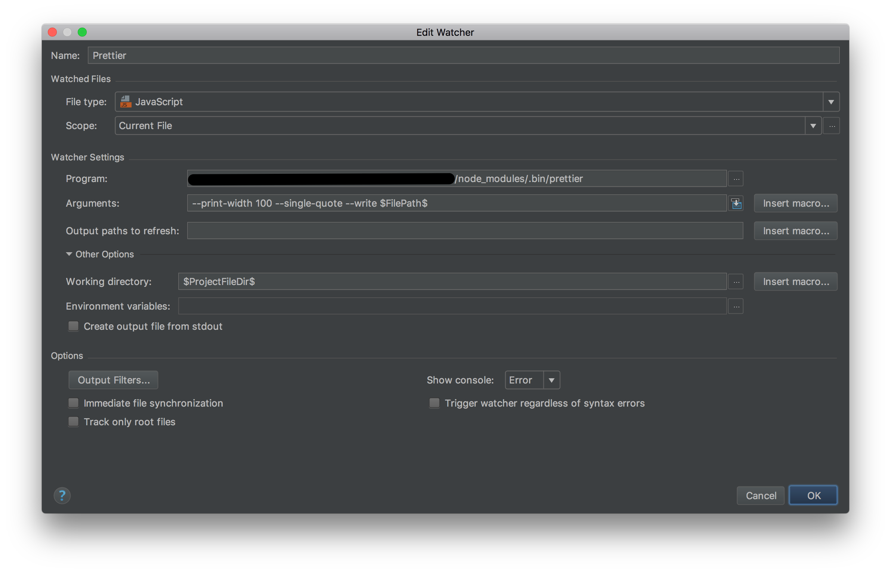

# React avec Create React App

## Ressources
- [javascript.info](http://javascript.info/) : The Modern JavaScript Tutorial
- [React](https://reactjs.org/) : JavaScript library for building UI
- [Create React App](https://github.com/facebookincubator/create-react-app) : React apps with no build configuration
- [Redux](https://redux.js.org/) : predictable state container for JavaScript apps
- [React Router](https://reacttraining.com/react-router/) : learn once, route anywhere
- <del>[React Router Redux](https://github.com/ReactTraining/react-router/tree/master/packages/react-router-redux) : recording, persisting, and replaying user actions, using time travel</del> __Project Deprecated__
- [Connected React Router](https://github.com/supasate/connected-react-router) : A Redux binding for React Router v4
- [React Loadable](https://github.com/thejameskyle/react-loadable) : HOC for loading components with dynamic imports
- [React Helmet](https://github.com/nfl/react-helmet) : manage all of your changes to the document head
- [React In-depth](https://developmentarc.gitbooks.io/react-indepth/) : exploration of UI development
- [React Bits]() : compilation of React Patterns, techniques, tips and tricks
- [PropTypes](https://reactjs.org/docs/typechecking-with-proptypes.html) : Typechecking With PropTypes
- [Webpack](https://webpack.js.org/) : bundle your assets
- [Babel](https://babeljs.io/) : JavaScript compiler
- [Yarn](https://yarnpkg.com/fr/) : fast, reliable, and secure dependency management


## Prérequis

[Installation de React Developer Tools](https://chrome.google.com/webstore/detail/react-developer-tools/fmkadmapgofadopljbjfkapdkoienihi)

[Installation de Redux DevTools](https://chrome.google.com/webstore/detail/redux-devtools/lmhkpmbekcpmknklioeibfkpmmfibljd)

[Installation de Node.js® >=8](https://nodejs.org/en/download/)

Debian/Ubuntu Linux

```bash
curl -sL https://deb.nodesource.com/setup_8.x | sudo -E bash -
sudo apt-get install -y nodejs build-essential
```

[Installation de Yarn](https://yarnpkg.com/lang/en/docs/install/)

Debian/Ubuntu Linux

```bash
curl -sS https://dl.yarnpkg.com/debian/pubkey.gpg | sudo apt-key add -

echo "deb https://dl.yarnpkg.com/debian/ stable main" | sudo tee /etc/apt/sources.list.d/yarn.list

sudo apt-get update && sudo apt-get install yarn

export PATH="$PATH:`yarn global bin`"
```

Windows : [Télécharger l’installateur](https://yarnpkg.com/latest.msi)

ou via [Chocolatey](https://chocolatey.org/)

```bash
choco install yarn
```

ou via [Scoop](http://scoop.sh/)

```bash
scoop install yarn
```

## Programme
1. Création du projet
  1.1. Prettier + PropTypes
  1.2. Prettier + PropTypes + ESLint
2. Ajout d'un composant statique
3. Ajout d'un second composant et utilisation des `props`
4. Gestion de l'état d'un composant
5. Gestion de l'état de l'application
6. Gestion de l'état de l'application avec Redux
7. Action asynchrone avec Redux Thunk
8. Routing avec React Router

___

### 1. Création du projet


```bash
yarn global add create-react-app
create-react-app my-app
cd my-app/
yarn start
```

<details>
  <summary>Solution</summary>
  [Création du projet avec create-react-app](https://github.com/devProbikeshop/levelup/commit/a0e80ede5e2fd8b0713493d8ac73f04d1fd6c1bf)
  [Ajout et config de Prettier, ESLint, PropTypes et Sass](https://github.com/devProbikeshop/levelup/commit/f178bb24674ba3bcebfe139fe60085a168d6aa23)
</details>


### 1.1 Prettier + PropTypes

Formater le code automatiquement

Installer [husky](https://yarnpkg.com/fr/package/husky) [lint-staged](https://yarnpkg.com/fr/package/lint-staged) [prettier](https://yarnpkg.com/fr/package/prettier)
```bash
yarn add husky lint-staged prettier onchange prop-types
```

mettre à jour le package.json

```diff
+  "lint-staged": {
+    "src/**/*.{js,jsx,json,css}": [
+      "prettier --single-quote --trailing-comma all --write",
+      "git add"
+    ]
+  },
  "scripts": {
+    "precommit": "lint-staged",
+    "prettier-watch": "onchange 'src/**/*.{js,jsx,json,css}' -- prettier  --single-quote --trailing-comma all --write {{changed}}"
```

formater le code actuel

```bash
yarn prettier --single-quote --write "src/**/*.{js,jsx}"
```

[PHPStorm](https://prettier.io/docs/en/webstorm.html)
Settings ou Preferences => Tools => File Watchers




<details>
  <summary>Solution</summary>
  [Ajout et config de Prettier, ESLint, PropTypes et Sass](https://github.com/devProbikeshop/levelup/commit/f178bb24674ba3bcebfe139fe60085a168d6aa23)
</details>

### 1.2 Prettier + PropTypes + ESLint + CSSComb

Installer les dépendances de ESLint et CSSComb

```
yarn add --dev eslint eslint-config-airbnb eslint-config-prettier eslint-plugin-import eslint-plugin-jsx-a11y eslint-plugin-prettier eslint-plugin-react csscomb
```

Ajouter la configuration suivante `.eslintrc.json`

```json
{
  "parser": "babel-eslint",
  "env": {
    "browser": true,
    "commonjs": true,
    "es6": true,
    "node": true
  },
  "extends": [
    "airbnb",
    "prettier",
    "prettier/react",
    "prettier/standard"
  ],
  "parserOptions": {
    "ecmaFeatures": {
      "experimentalObjectRestSpread": true,
      "jsx": true
    },
    "sourceType": "module"
  },
  "plugins": [
    "prettier",
    "import"
  ],
  "rules": {
    "no-param-reassign": 1,
    "react/jsx-filename-extension": false,
    "linebreak-style": [
      "error",
      "unix"
    ],
    "prettier/prettier": ["error", {
      "singleQuote": true,
      "trailingComma": "all",
      "bracketSpacing": true,
      "jsxBracketSameLine": false,
    }]
  }
}
```

Récupérer la configuration [`.csscomb.json`](https://github.com/devProbikeshop/frontend/blob/2529b0ec/.csscomb.json)

Pour vérifier qu'il n'y a pas de conflits de conf : ajouter, et exécuter, le script suivant dans le `package.json` :

```
"eslint-check": "eslint --print-config .eslintrc.json | eslint-config-prettier-check",
```

Modifier la commande `lint-staged` pour utiliser ESLint à la place de Prettier

Ajouter un script `eslint-watch` sur le modèle de `prettier-watch`


### 2. Ajout d'un composant statique

Renommer

`+my-app/src/App.js => my-app/src/App.jsx`

Créer les fichiers

`+my-app/src/ProductList.jsx`
`+my-app/src/products.json`

ProductList.jsx est un composant React qui rend une liste de produits.
products.json est un JSON contenant les données des produits

```
import React, { Component } from 'react';
import products from './products.json';


class ProductList extends Component {
    render() {
        // TODO boucler sur les produits pour afficher le nom, le prix et l'image
    }
}
 
export default ProductList;
```

Utiliser ProductList.jsx dans App.jsx

<details> 
  <summary>Contenu de products.json</summary>

```json
[
    {
      "id": 1,
      "name": "Vélo de Ville Électrique MATRA i-FLOW FREE N7 Noir 2017",
      "price": "1 499,99",
      "currencySymbol": "€",
      "currencyCode": "EUR",
      "image":
        "https://assets.probikeshop.fr/images/products2/562/135334/380x380-135334_14927290547322.jpg",
      "description":
        "<p>Hey, Luke! May the Force be with you. I suggest you try it again, Luke. This time, let go your conscious self and act on instinct. The plans you refer to will soon be back in our hands. Escape is not his plan. I must face him, alone.</p><p>Dantooine. They're on Dantooine. In my experience, there is no such thing as luck. All right. Well, take care of yourself, Han. I guess that's what you're best at, ain't it? Don't underestimate the Force.</p><p>All right. Well, take care of yourself, Han. <strong> I guess that's what you're best at, ain't it?</strong> <em> I'm surprised you had the courage to take the responsibility yourself.</em> I'm surprised you had the courage to take the responsibility yourself.</p><p>She must have hidden the plans in the escape pod. Send a detachment down to retrieve them, and see to it personally, Commander. There'll be no one to stop us this time! A tremor in the Force. The last time I felt it was in the presence of my old master.</p><p>She must have hidden the plans in the escape pod. Send a detachment down to retrieve them, and see to it personally, Commander. There'll be no one to stop us this time! Oh God, my uncle. How am I ever gonna explain this?</p>"
    },
    {
      "id": 2,
      "name":
        "Vélo de Voyage Électrique GHOST HYBRIDE SQUARE TREKKING 4 Noir 2017",
      "price": "1 999,99",
      "currencySymbol": "€",
      "currencyCode": "EUR",
      "image":
        "https://assets.probikeshop.fr/images/products2/226/131033/380x380-131033_14914655592642.jpg",
      "description":
        "<p>Hey, Luke! May the Force be with you. I suggest you try it again, Luke. This time, let go your conscious self and act on instinct. The plans you refer to will soon be back in our hands. Escape is not his plan. I must face him, alone.</p><p>Dantooine. They're on Dantooine. In my experience, there is no such thing as luck. All right. Well, take care of yourself, Han. I guess that's what you're best at, ain't it? Don't underestimate the Force.</p><p>All right. Well, take care of yourself, Han. <strong> I guess that's what you're best at, ain't it?</strong> <em> I'm surprised you had the courage to take the responsibility yourself.</em> I'm surprised you had the courage to take the responsibility yourself.</p><p>She must have hidden the plans in the escape pod. Send a detachment down to retrieve them, and see to it personally, Commander. There'll be no one to stop us this time! A tremor in the Force. The last time I felt it was in the presence of my old master.</p><p>She must have hidden the plans in the escape pod. Send a detachment down to retrieve them, and see to it personally, Commander. There'll be no one to stop us this time! Oh God, my uncle. How am I ever gonna explain this?</p>"
    },
    {
      "id": 3,
      "name": "Vélo de Voyage Électrique FELT QXe85-EQ Gris 2017",
      "price": "2 199,99",
      "currencySymbol": "€",
      "currencyCode": "EUR",
      "image":
        "https://assets.probikeshop.fr/images/products2/532/132502/380x380-132502_14979603391364.jpg",
      "description":
        "<p>Hey, Luke! May the Force be with you. I suggest you try it again, Luke. This time, let go your conscious self and act on instinct. The plans you refer to will soon be back in our hands. Escape is not his plan. I must face him, alone.</p><p>Dantooine. They're on Dantooine. In my experience, there is no such thing as luck. All right. Well, take care of yourself, Han. I guess that's what you're best at, ain't it? Don't underestimate the Force.</p><p>All right. Well, take care of yourself, Han. <strong> I guess that's what you're best at, ain't it?</strong> <em> I'm surprised you had the courage to take the responsibility yourself.</em> I'm surprised you had the courage to take the responsibility yourself.</p><p>She must have hidden the plans in the escape pod. Send a detachment down to retrieve them, and see to it personally, Commander. There'll be no one to stop us this time! A tremor in the Force. The last time I felt it was in the presence of my old master.</p><p>She must have hidden the plans in the escape pod. Send a detachment down to retrieve them, and see to it personally, Commander. There'll be no one to stop us this time! Oh God, my uncle. How am I ever gonna explain this?</p>"
    },
    {
      "id": 4,
      "name": "Vélo de Ville Électrique ORTLER KINGMAN Bleu",
      "price": "1 249,00",
      "currencySymbol": "€",
      "currencyCode": "EUR",
      "image":
        "https://images.internetstores.de/products//585313/02/606c9a/Ortler_Kingman_blue[380x380].jpg?forceSize=true&forceAspectRatio=true&forceAlign=center",
      "description":
        "<p>Hey, Luke! May the Force be with you. I suggest you try it again, Luke. This time, let go your conscious self and act on instinct. The plans you refer to will soon be back in our hands. Escape is not his plan. I must face him, alone.</p><p>Dantooine. They're on Dantooine. In my experience, there is no such thing as luck. All right. Well, take care of yourself, Han. I guess that's what you're best at, ain't it? Don't underestimate the Force.</p><p>All right. Well, take care of yourself, Han. <strong> I guess that's what you're best at, ain't it?</strong> <em> I'm surprised you had the courage to take the responsibility yourself.</em> I'm surprised you had the courage to take the responsibility yourself.</p><p>She must have hidden the plans in the escape pod. Send a detachment down to retrieve them, and see to it personally, Commander. There'll be no one to stop us this time! A tremor in the Force. The last time I felt it was in the presence of my old master.</p><p>She must have hidden the plans in the escape pod. Send a detachment down to retrieve them, and see to it personally, Commander. There'll be no one to stop us this time! Oh God, my uncle. How am I ever gonna explain this?</p>"
    },
    {
      "id": 5,
      "name": "Vélo de Ville Électrique MATRA i-FLOW FREE D8 Noir 2017",
      "price": "1 299,99",
      "currencySymbol": "€",
      "currencyCode": "EUR",
      "image":
        "https://assets.probikeshop.fr/images/products2/562/135331/380x380-135331_14873430326509.jpg",
      "description":
        "<p>Hey, Luke! May the Force be with you. I suggest you try it again, Luke. This time, let go your conscious self and act on instinct. The plans you refer to will soon be back in our hands. Escape is not his plan. I must face him, alone.</p><p>Dantooine. They're on Dantooine. In my experience, there is no such thing as luck. All right. Well, take care of yourself, Han. I guess that's what you're best at, ain't it? Don't underestimate the Force.</p><p>All right. Well, take care of yourself, Han. <strong> I guess that's what you're best at, ain't it?</strong> <em> I'm surprised you had the courage to take the responsibility yourself.</em> I'm surprised you had the courage to take the responsibility yourself.</p><p>She must have hidden the plans in the escape pod. Send a detachment down to retrieve them, and see to it personally, Commander. There'll be no one to stop us this time! A tremor in the Force. The last time I felt it was in the presence of my old master.</p><p>She must have hidden the plans in the escape pod. Send a detachment down to retrieve them, and see to it personally, Commander. There'll be no one to stop us this time! Oh God, my uncle. How am I ever gonna explain this?</p>"
    },
    {
      "id": 6,
      "name": "Vélo de Ville Électrique MATRA i-FLOW FREE D8 Blanc 2017",
      "price": "1 299,99",
      "currencySymbol": "€",
      "currencyCode": "EUR",
      "image":
        "https://assets.probikeshop.fr/images/products2/562/135333/380x380-135333_14873433261445.jpg",
      "description":
        "<p>Hey, Luke! May the Force be with you. I suggest you try it again, Luke. This time, let go your conscious self and act on instinct. The plans you refer to will soon be back in our hands. Escape is not his plan. I must face him, alone.</p><p>Dantooine. They're on Dantooine. In my experience, there is no such thing as luck. All right. Well, take care of yourself, Han. I guess that's what you're best at, ain't it? Don't underestimate the Force.</p><p>All right. Well, take care of yourself, Han. <strong> I guess that's what you're best at, ain't it?</strong> <em> I'm surprised you had the courage to take the responsibility yourself.</em> I'm surprised you had the courage to take the responsibility yourself.</p><p>She must have hidden the plans in the escape pod. Send a detachment down to retrieve them, and see to it personally, Commander. There'll be no one to stop us this time! A tremor in the Force. The last time I felt it was in the presence of my old master.</p><p>She must have hidden the plans in the escape pod. Send a detachment down to retrieve them, and see to it personally, Commander. There'll be no one to stop us this time! Oh God, my uncle. How am I ever gonna explain this?</p>"
    }
  ]
```

</details>

<details>
  <summary>Solution</summary>
  [Ajout d'un composant statique](https://github.com/devProbikeshop/levelup/commit/ac61ea19731703548b08023453147c856b3d8052)
</details>

### 3. Ajout d'un second composant et utilisation des `props`

Créer le fichier

`+my-app/src/Product.jsx`

Product.jsx est un composant React qui rend un produit.
Modifier ProductList pour utiliser Product en passant des données en props

```
import React, { Component } from 'react';
 
class Product extends Component {
    render() {
        // TODO utiliser les props pour afficher le nom, le prix et l'image
    }
}
 
export default Product;
```

<details>
  <summary>Solution</summary>
  [Création d'un composant pour rendre les produits](https://github.com/devProbikeshop/levelup/commit/f320e1f155947918d83871a0b198e8b826c6abd6)
</details>

### 4. Gestion de l'état d'un composant

Modifier le composant Product pour gérer un état "est dans le panier"
Ajouter un bouton "Ajouter au panier", au clic le panier "est dans le panier"
Ajouter un bouton "Supprimer au panier", au clic le panier "n' est plus dans le panier"
Afficher l'un ou l'autre des boutons en fonction de l'état

<details>
  <summary>Solution</summary>
  [Gestion de l’état d’un composant](https://github.com/devProbikeshop/levelup/commit/1e3be8d6d908d09e7c740e0794020f507fad573e)
</details>

### 5. Gestion de l'état de l'application

Modifier l'application (App.jsx) afin de pouvoir stocker les produits ajoutés au panier
Créer les méthodes permettant d'ajouter/supprimer les produits, les passer en props au composant ProductList puis Product
Créer un functional component ShoppinCart qui affiche le nombre de produit dans le panier

<details>
  <summary>Solution</summary>
  [Gestion de l’état de l’application](https://github.com/devProbikeshop/levelup/commit/a97663a0b516cc4c295ed6623cfea92993afe11c)
</details>

### 6. Gestion de l'état de l'application avec Redux

Installation des dépendances 

```
yarn add react-redux redux redux-devtool redux-logger redux-thunk
```

Créer les fichiers

`my-app/src/actions/shoppingCart.js`
`my-app/src/reducers/index.js`
`my-app/src/reducers/basket.js`

`actions/shoppingCart.js` exportera deux méthodes (pour créer les actions ADD_TO_BASKET/REMOVE_FROM_BASKET)

`reducers/index.js` utilisera l'[API combineReducers](https://redux.js.org/docs/api/combineReducers.html) de Redux pour pouvoir ensuite créer le Store

`reducers/basket.js` exporte un méthode permettant de mettre à jour le Store en fonction des actions ADD_TO_BASKET/REMOVE_FROM_BASKET

Modifier les fichiers

`my-app/src/App.jsx`
`my-app/src/index.js`

Dans App.jsx l'état du composant sera remplacé par l'état du Store Redux. Il se chargera du dispatch des actions (utilisation de l'API [connect et bindActionCreators](https://github.com/reactjs/react-redux/blob/master/docs/api.md#inject-todos-and-todoactioncreators-and-counteractioncreators-together-as-actions))

Dans index.js le Store sera créé à partir des Reducers et Middlewares (API [createStore](https://redux.js.org/docs/api/createStore.html), [compose](https://redux.js.org/docs/api/compose.html), [applyMiddleware](https://redux.js.org/docs/api/applyMiddleware.html))

<details>
  <summary>Solution</summary>
  [Gestion de l'état de l'application avec Redux](https://github.com/devProbikeshop/levelup/commit/e7f2015d28df5aa5bf7584e553be05a765b90d7b)
</details>

### 9. Action asynchrone avec Redux Thunk

Installation de [json-server](https://yarnpkg.com/en/package/json-server)

```
yarn add yarn-run-all
yarn add --dev json-server
```

Modifier le fichier products.json pour avoir un objet json de la forme :
```json
{
    "products": [
        {},
        ...
        {},
        {}
    ]
}
```
Modifier le `package.json` pour démarrer le faux serveur d'API REST, et définir un proxy pour les appels effectués avec fetch
```diff
  "scripts": {
+   "api": "json-server --watch src/db.json --port 3001", 
+   "start-dev": "npm-run-all --parallel prettier-watch start api",
...
  },
+ "proxy": "http://localhost:3001", 
```

Créer les actions et reducers
`my-app/src/actions/products.js`
`my-app/src/reducers/index.js`
`my-app/src/reducers/products.js`

`my-app/src/actions/products.js` exporte une une méthode qui dispatch les actions FETCH_PRODUCTS, FETCH_PRODUCTS_SUCCESS, FETCH_PRODUCTS_ERROR en fonction de l'état de l'appel à l'API REST /products via [fetch](https://developer.mozilla.org/en-US/docs/Web/API/Fetch_API).

`my-app/src/reducers/index.js` combine les reducers de notre application

`my-app/src/reducers/products.js` exporte une méthode pour mettre à jour le Store en fonction des actions FETCH_PRODUCTS, FETCH_PRODUCTS_SUCCESS, FETCH_PRODUCTS_ERROR

Modifier le point d'entrée pour ajouter le middleware redux-thunk  dans `my-app/src/index.js`

Modifier le composant `my-app/src/ProductList.jsx` pour afficher un bouton à la place de la liste des produits. Au clic on dispatche l'action pour charger les produits, pendant le chargement afficher un loader, en cas de succès on affiche les produits, en cas d'erreur un beau message d'erreur.

<details>
  <summary>Solution</summary>
  [Action asynchrone avec Redux Thunk](https://github.com/devProbikeshop/levelup/commit/a1c1c900fb9f2fe1dd2691bc3c0f30b6ba7227f8)
</details>

### 10. Routing avec React Router

Installation des dépendances

```
yarn add history react-router-dom connected-react-router
```

Modifier le point d'entrée pour initialiser l'historique avec [history/createBrowserHistory](https://github.com/ReactTraining/history) (cet historique sera utilisé par le routerMiddleware et en props de notre app)

Appliquer le middleware [routerMiddleware](https://github.com/ReactTraining/react-router/tree/master/packages/react-router-redux) à redux pour synchroniser Store et navigation

Ajouter routerReducer dans combineReducers

Dans l'application principal, utiliser ConnectedRouter de react-router-redux et [Route de react-router-dom](https://reacttraining.com/react-router/web/api/Route) pour définir le routing de notre application

ProductList sera rendu sur l'URL `/`
ProductDetail (nouveau composant) sera rendu sur l'URL `/p:id`

Créer le composant ProductDetail qui permet d'afficher les infos du produits en faisant appel à l'API GET /products/:id (utilisation de Redux en asynchrone)

Utiliser [Link de react-router-dom](https://reacttraining.com/react-router/web/api/Link) pour faire le lien entre un produit de la liste et la page détail

<details>
  <summary>Solution</summary>
  [Routing avec React Router](https://github.com/devProbikeshop/levelup/commit/e458c7e324fd509186188ba16505bffc1c0d9d9e)
</details>
